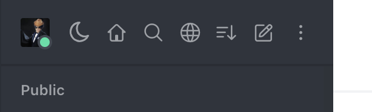
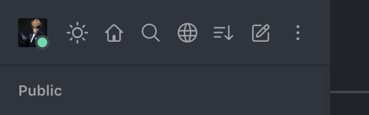
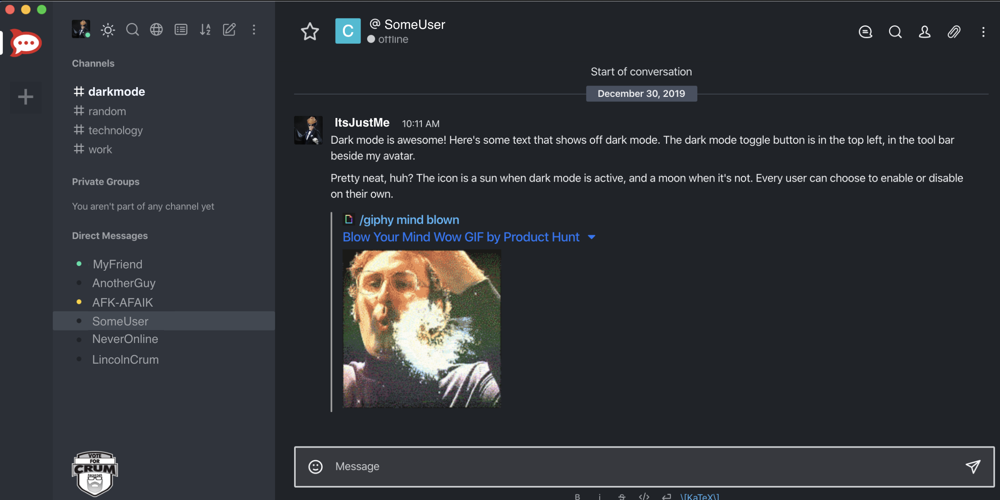

# rocketchat-dark-mode

> **An easy user-togglable dark mode for Rocket.Chat**

This repo was migrated for ease of collaboration from [my gist](https://gist.github.com/pbaity/73beb1dd11fdc8b90e4ee032f1b3f7de) which was a fork of [**chall8909**'s gist](https://gist.github.com/chall8908/c03dd6cc443cdb9cbb7034d441a1350d), to which this project is greatly indebted.

## Overview

[**dark-mode-toggle.js**](dark-mode-toggle.js) creates and adds a click handler for a dark mode toggle button. This toggle button lives in the toolbar at the top of the left-hand sidebar:

And when dark mode is active:

[**dark-mode.css**](dark-mode.css) contains the styles which - y'know, make everything dark, like so:

## Installation

If you want to "install" this dark mode, here's all you need to do:

1. Be an administrator of your Rocket.Chat instance, or send these instructions to one and pester them to do it for you
2. Go to the **Administration** panel > **Layout**
3. Copy the contents of [dark-mode.css](dark-mode.css) into **Custom CSS**
4. Copy the contents of [dark-mode-toggle.js](dark-mode-toggle.js) into **Custom Scripts** > **Custom Script for Logged In Users**
5. Refresh your local Rocket.Chat instance (a server restart is _not_ required). You may need to clear your cache if using a web browser.

## Problems?

If you encounter any problems with this dark mode plugin, please open an issue - or better yet, fix it and open a pull request. If you're a JavaScript or CSS wizard (I'm not), feel free to add features and styles or improve code quality. It's always appreciated.  
